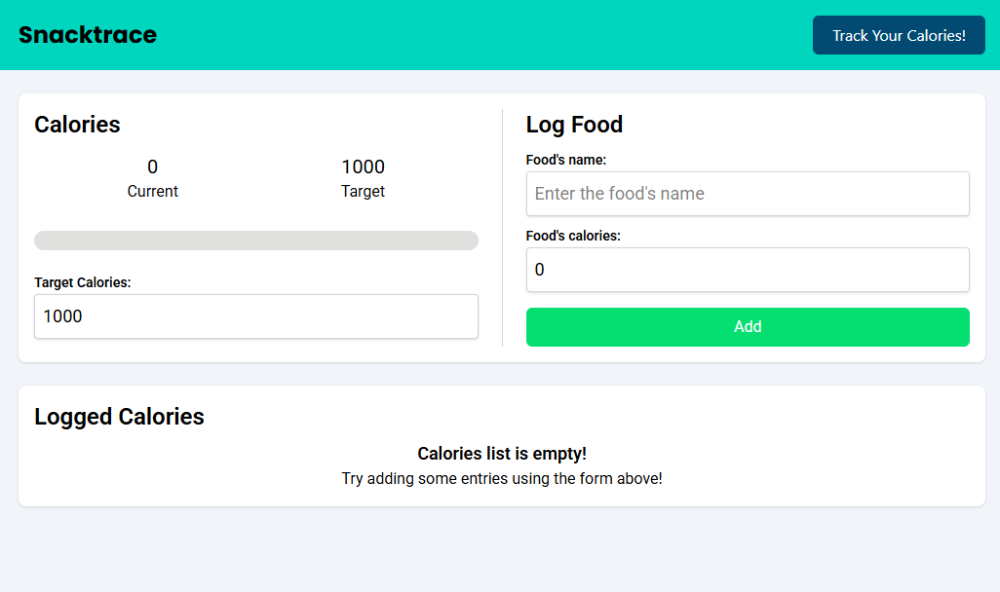
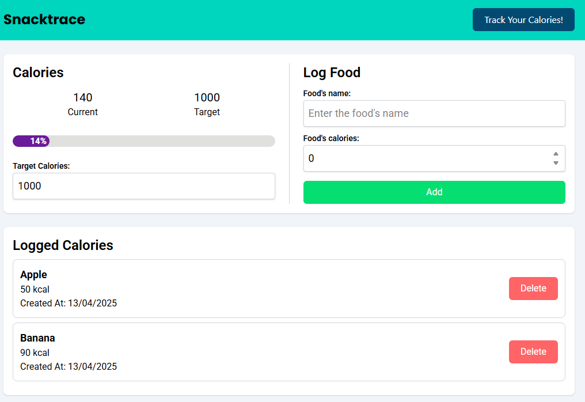

# 🍿 SnackTrace

SnackTrace is a simple and lightweight calorie tracking app built with React and TypeScript. Set your daily calorie goal and log your snacks and meals with ease.

---

## 🚀 Features

- 🎯 Set a daily calorie target
- 🍔 Log foods and track consumed calories
- 📊 Instantly see how much you've eaten and how much is left

---

## 🛠️ Tech Stack

- [React](https://reactjs.org/)
- [Tailwind CSS](https://tailwindcss.com/)
- [TypeScript](https://www.typescriptlang.org/)

---

## 🖥️ How to Run

1. Clone the repository:
   ```bash
   git clone https://github.com/ttinonin/snacktrace.git
   cd snacktrace
   ```

2. Download dependencies:
  ```bash
  npm i
  ```

3. Run the development sever:
  ```bash
  npm run dev
  ```

## 📸 Preview





## 📦 Future Improvements

- Persistent storage (localStorage or database)
- Macronutrient breakdown (protein, carbs, fats)

## Contributing

Contributions are welcome! Please fork the repository, create a new branch for your feature, and submit a pull request.

## License

This project is licensed under the MIT License. See the [LICENSE](./LICENSE) file for details.